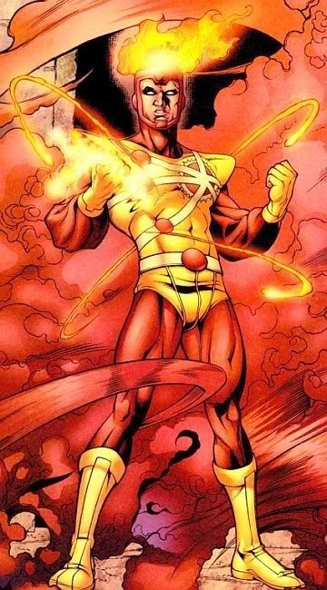
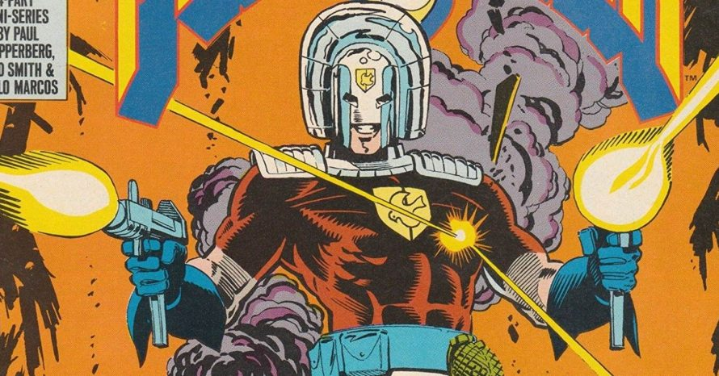

# Haskellator Heroes

**Disciplina**: FGA0210 - PARADIGMAS DE PROGRAMAÇÃO - T02 <br>
**Nro do Grupo (de acordo com a Planilha de Divisão dos Grupos)**: 03<br>
**Paradigma**: Funcional<br>

## Alunos
|Matrícula | Aluno |
| -- | -- |
| Adrian Soares Lopes | 160000572 |
| Bianca Sofia Brasil de Oliveira | 190025298 |
| Daniel Vinicius Ribeiro Alves | 190026375 |
| Daniela Soares de Oliveira | 180015222 |
| Eduardo Maia Rezende | 180119231 |
| Erick Melo Vidal de Oliveira | 190027355 |
| João Victor Max Bisinotti de Oliveira | 170069991 |
| Klyssmann Henrique Ferreira de Oliveira | 202028202 |
| Vitor Eduardo Kühl Rodrigues | 190118288 |

## Sobre 
Olá e bem-vindo ao mundo do Haskellator Heroes!

Haskellator Heroes é um jogo de adivinhação em Haskell que desafia você a pensar em um herói fictício e adivinhar quem é com o menor número possível de perguntas. É um jogo divertido e viciante que usa uma árvore binária de decisão para modelar as possíveis respostas e tornar a experiência do jogador única a cada rodada.

Com uma interface amigável e fácil de usar, Haskellator Heroes é adequado para jogadores de todas as idades e habilidades. O sistema inteligente de adivinhação fará perguntas de múltipla escolha, testando seus conhecimentos sobre seus heróis favoritos e ajudando você a escolher o caminho certo para descobrir o herói escolhido.

Além disso, Haskellator Heroes é uma ótima maneira de aprender sobre programação funcional em Haskell. O jogo é projetado para apresentar conceitos de programação, como árvores binárias de decisão, de uma maneira divertida e interativa. Com Haskellator Heroes, você pode aprender enquanto se diverte!

Não espere mais, jogue Haskellator Heroes hoje mesmo e desafie-se a adivinhar o herói fictício com o menor número possível de perguntas. Divirta-se enquanto aprende sobre programação funcional e teste seus conhecimentos sobre seus heróis favoritos. Jogue agora e seja um verdadeiro herói do Haskellator Heroes!
Escopo de heróis do jogo:

| Herói | Imagem |
| :-: | :-: |
| Arqueiro Verde |  |
| Batgirl |  |
| Batman |  |
| Caçador de Marte |  |
| Canário Negro |  |
| Cyborg | |
| Demolidor | |
| Dr. Destino |  |
| Flash |   |
| Homem Elástico |  |
| Lanterna Verde | |
| Mulher-Maravilha | |
| Nuclear | |
| Pacificador |  |
| Super Choque |  |
| Superman |  |
| Zatanna |  |

## Screenshots
Adicione 2 ou mais screenshots do projeto em termos de interface e/ou funcionamento.

## Instalação 
**Linguagens**: Haskell<br>
**Tecnologias**: xxxxxx<br>
Descreva os pré-requisitos para rodar o seu projeto e os comandos necessários.
Insira um manual ou um script para auxiliar ainda mais.
Gifs animados e outras ilustrações são bem-vindos!

## Uso 
Explique como usar seu projeto.
Procure ilustrar em passos, com apoio de telas do software, seja com base na interface gráfica, seja com base no terminal.
Nessa seção, deve-se revelar de forma clara sobre o funcionamento do software.
```bash
    ghc -main-is Main.main -o jogo Hero.hs Tree.hs Main.hs
```

## Vídeo
Adicione 1 ou mais vídeos com a execução do projeto.
Procure: 
(i) Introduzir o projeto;
(ii) Mostrar passo a passo o código, explicando-o, e deixando claro o que é de terceiros, e o que é contribuição real da equipe;
(iii) Apresentar particularidades do Paradigma, da Linguagem, e das Tecnologias, e
(iV) Apresentar lições aprendidas, contribuições, pendências, e ideias para trabalhos futuros.
OBS: TODOS DEVEM PARTICIPAR, CONFERINDO PONTOS DE VISTA.
TEMPO: +/- 15min

## Participações
Apresente, brevemente, como cada membro do grupo contribuiu para o projeto.
|Nome do Membro | Contribuição | Significância da Contribuição para o Projeto (Excelente/Boa/Regular/Ruim/Nula) |
| -- | -- | -- |
| Adrian Soares Lopes | TBC | TBC |
| Bianca Sofia Brasil de Oliveira | TBC | TBC |
| Daniel Vinicius Ribeiro Alves | TBC | TBC |
| Daniela Soares de Oliveira | TBC | TBC |
| Eduardo Maia Rezende | TBC | TBC |
| Erick Melo Vidal de Oliveira | TBC | TBC |
| João Victor Max Bisinotti de Oliveira | TBC | TBC |
| Klyssmann Henrique Ferreira de Oliveira | TBC | TBC |
| Vitor Eduardo Kühl Rodrigues | TBC | TBC |

## Outros 
Quaisquer outras informações sobre o projeto podem ser descritas aqui. Não esqueça, entretanto, de informar sobre:
(i) Lições Aprendidas;
(ii) Percepções;
(iii) Contribuições e Fragilidades, e
(iV) Trabalhos Futuros.

## Fontes
Referencie, adequadamente, as referências utilizadas.
Indique ainda sobre fontes de leitura complementares.
