# Sobre o Projeto
_____

Olá e bem-vindo ao mundo do Haskellator Heroes!

Haskellator Heroes é um jogo de adivinhação em Haskell que desafia você a pensar em um herói fictício e adivinhar quem é com o menor número possível de perguntas. É um jogo divertido e viciante que usa uma árvore binária de decisão para modelar as possíveis respostas e tornar a experiência do jogador única a cada rodada.

Com uma interface amigável e fácil de usar, Haskellator Heroes é adequado para jogadores de todas as idades e habilidades. O sistema inteligente de adivinhação fará perguntas de múltipla escolha, testando seus conhecimentos sobre seus heróis favoritos e ajudando você a escolher o caminho certo para descobrir o herói escolhido.

Além disso, Haskellator Heroes é uma ótima maneira de aprender sobre programação funcional em Haskell. O jogo é projetado para apresentar conceitos de programação, como árvores binárias de decisão, de uma maneira divertida e interativa. Com Haskellator Heroes, você pode aprender enquanto se diverte!

Não espere mais, jogue Haskellator Heroes hoje mesmo e desafie-se a adivinhar o herói fictício com o menor número possível de perguntas. Divirta-se enquanto aprende sobre programação funcional e teste seus conhecimentos sobre seus heróis favoritos. Jogue agora e seja um verdadeiro herói do Haskellator Heroes!

Escopo dos heróis presentes no jogo: 

| Herói | Imagem | Descrição |
| :-: | :-: | :-: |
| Arqueiro Verde | 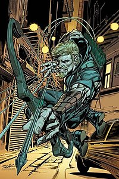 | O Arqueiro Verde é um personagem da DC Comics que usa sua habilidade de arquearia, combate corpo a corpo, agilidade e força sobre-humanas para lutar contra o crime em Star City. Ele é conhecido por sua personalidade impulsiva, mas também é um filantropo dedicado a ajudar aqueles em necessidade. Oliver Queen mantém sua identidade secreta como o Arqueiro Verde e muitas vezes usa outras armas, como facas e pistolas, em sua luta contra o mal. |
| Batgirl | 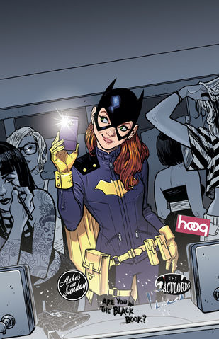 | Barbara Gordon foi a primeira Batgirl, uma vigilante adolescente inspirada pelo Batman, mas também por seu pai adotivo, o comissário de polícia Jim Gordon. Um encontro que mudou sua vida com o Coringa fez com que ela perdesse o uso das pernas, mas ela não deixou que isso a impedisse. Usando suas habilidades com o computador, ela se tornou a Oráculo, a principal fornecedora de informações para todos os heróis e a fundadora das Aves de Rapina.|
| Batman | 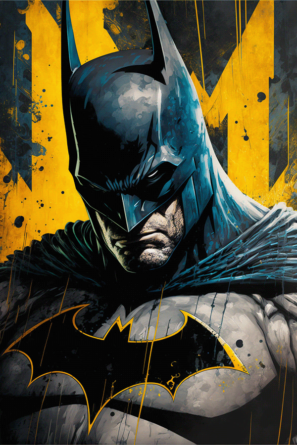 | Batman (Bruce Wayne): Playboy de dia e super-herói à noite, é um ótimo detetive, e dono de uma inteligência incrível, alem de ser um ótimo atleta. Foi treinado em todas as formas de combate físico e também é mestre em fugas e disfarces. Possui várias armas, veículos e claro, o seu cinto de utilidades que tem tudo o que o herói precisa, desde um simples clipe de papel até um fragmento de kryptonita. E um dos poucos membros da equipe que não possui nem um super poder, mas nem por isso deixa de ser temido e respeitado por todos. |
| Caçador de Marte | 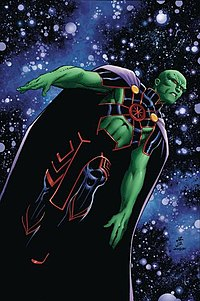 | O Caçador de Marte, também conhecido como J'onn J'onzz, é um herói da DC Comics com habilidades únicas e um conjunto de objetos que ele usa para ajudá-lo em sua luta contra o crime. No Brasil, durante muitos anos o personagem foi chamado de Ajax, o marciano. Em sua versão original, ou seja, o corpo que veio à Terra, e sua forma verdadeira, ele possui um corpo alto e magro. Sua cabeça é pontuda e fina com olhos vermelhos e pele verde. |
| Canário Negro | 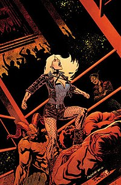 | Canário Negro é uma heroína e atual líder da Liga da Justiça, a instrutora de combate corpo-a-corpo para a equipe, e a filha do original Canário Negro. A combinação do sex appeal acentuado pela sua marca registrada, as meias arrastão, com a sua coragem e sua ótima técnica de luta a tornaram uma das personagens femininas mais conhecidas da editora. |
| Cyborg | 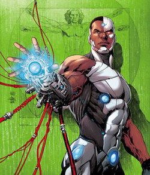| Victor Stone é um Ciborgue. Mantido vivo pelo revestimento de Promécio e aprimoramentos cibernéticos, ele temia se tornar um pária, até que encontrou uma nova família - os Novos Titãs. O Cyborg possui aprimoramentos cibernéticos que fornecem força, resistência e durabilidade sobre-humanas. Cyborg também pode interagir com computadores. Construído em sua armadura havia um olho infravermelho, um gerador de computador, um amplificador de som/um canhão de ruído branco e adaptadores de programação especiais que permitiam a ele interagir com outras extensões do corpo. |
| Sr. Destino | 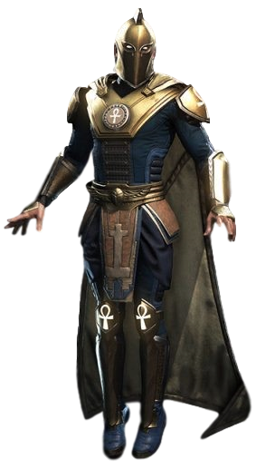 | Sr. Destino é um mago poderoso, com os melhores interesses para o mundo no coração. Ele pode controlar os elementos naturais (Terra, fogo, , água), dar vida a objetos, disparar rajadas místicas, abrir portais para outras dimensões, voar, criar um poderoso escudo imperfurável,controlar qualquer outro tipo de matéria etc, etc.  |
| Dr. Meia Noite | 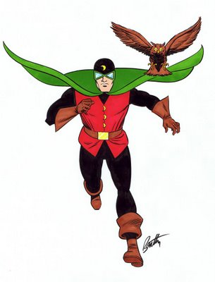|  O Doutor Charles McNider era um médico que foi chamado pela polícia para salvar uma testemunha-chave de um processo contra o crime organizado, que havia sido baleada por um assassino profissional. Enquanto McNider realizava a cirurgia, o assassino descobriu que sua vítima havia sobrevivido e invadiu o hospital, jogando uma granada na sala de operação que matou a testemunha e cegou McNider. Adotando a coruja como seu mascote, McNider criou um par de visores que o permitiam enxergar na claridade e um arsenal de bombas-blecaute que liberavam um densa fumaça negra onde McNider podia enxergar com clareza, e assumiu a identidade do super-herói Doutor Meia-Noite, levando os criminosos que o cegaram à justiça.|
| Flash |   | Barry Allen era um funcionário da polícia científica, quando foi banhado por produtos químicos após seu laboratório ser atingido por um raio. Esse acidente fez que ele, assim como Jay Garrick, fosse capaz de canalizar a Força da Aceleração para correr em velocidades altíssimas. |
| Homem Elástico | 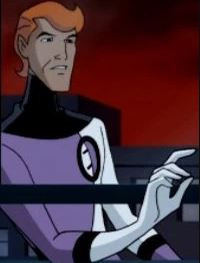 | O Homem-Elástico podia esticar qualquer parte de seu corpo até incríveis comprimentos. É muito bom no combate corpo-a-corpo sem utilizar seus poderes e é um bom detetive. Quanto a seu poder, para mantê-lo, deve tomar o suco de Gingold regularmente. Seu uniforme é feito de um nylon especial que estica e encolhe com seu corpo. O Homem-Elástico possuia uma mente engenhosamente dedutiva e um incrível talento como detetive. Ele é fascinado por mistérios e, invariavelmente, quando fica intrigado por algum, seu nariz cresce e estremece. |
| Lanterna Verde | 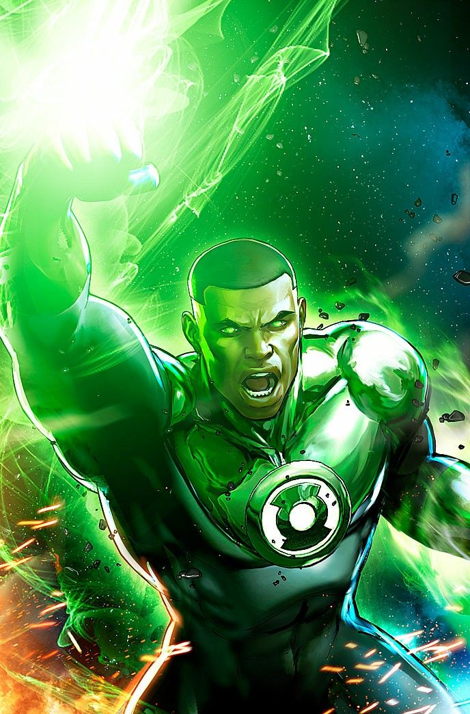| Lanterna Verde: John Stewart era um militar negro que foi escolhido pelos Guardiões do Universo do Planeta OA para portar o anel. Esse anel é que o dá grande controle sobre o físico, limitado por três coisas: a imaginação de seu usuário, a necessidade de recarga a cada 24 horas e a vulnerabilidade à cor amarela, onde o anel não surte efeito algum (uma impureza do anel) Após 13 Eras como Lanterna Verde John Stewart Deixa o Manto de Lanterna Verde 1 Mes depois Hal Jordan Assume o Manto deixado Por seu Pai. |
| Mulher-Maravilha | 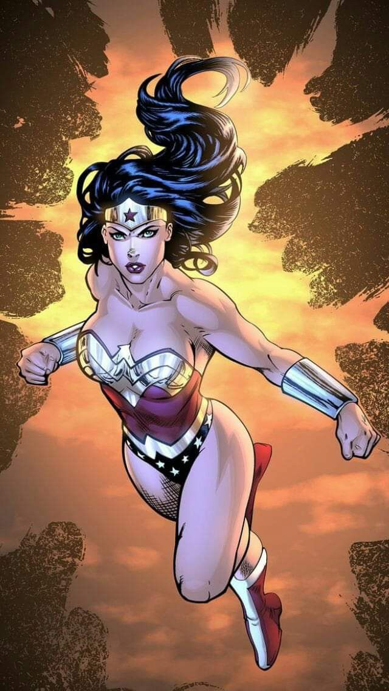| Mulher-Maravilha (Princesa Diana): Princesa de Themyscira, filha de Hipólita a Rainha das Amazonas. Possui força sobre-humana, capacidade de voar e de se mover rápido o bastante para desviar balas com seus braceletes de prata. Treinada em todas as formas de combate armado e desarmado da Grécia Antiga. Portadora do inquebrável Laço da Verdade, forjado pela deusa Héstia, que obriga qualquer um preso por ele a dizer a verdade.  |
| Nuclear | 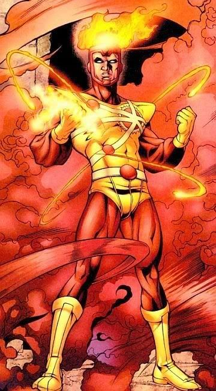| Nuclear (Firestorm - Tempestade de Fogo no original) é um super-herói que surgiu com a fusão de Ronnie Raymond e o Professor Martin Stein durante uma explosão nuclear. Anos mais tarde Ronnie e Stein se separaram e Ronnie passou a ser o Nuclear sem precisar se fundir com outro individuo. Mais tarde ele acabou sendo morto e seu poder passou para Jason Rusch. |
| Pacificador | 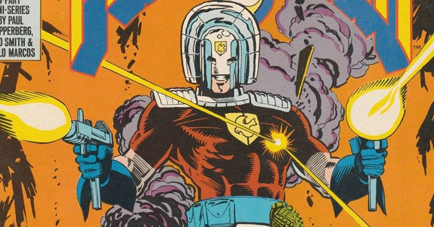 | Christopher Smith é um ser humano comum e não tem poderes. No entanto, possui diversas habilidades, com destaque para: conhecimentos avançados de combate corpo a corpo; manuseio de armas de fogo; análise tática; exímio motorista e piloto de avião. A principal fraqueza do Pacificador são seus evidentes problemas mentais, já que dizia escutar a voz de seu pai e acreditava que almas dos que foram mortos por ele viviam em seu capacete. No entanto, conseguiu superar essas questões recentemente. |
| Super Choque | 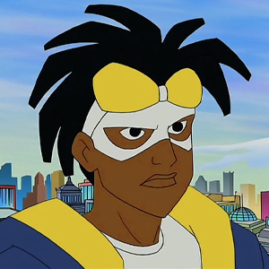 | O jovem Virgil Hawkins ganha incríveis poderes eletromagnéticos após ser exposto a um estranho gás. Ele decide usar os seus novos poderes para se tornar um herói e combater o crime, contando com a ajuda de seu amigo Osgood, um grande inventor. |
| Superman |  | Superman (Clark Kent): Filho de Jor-El e de Lara, Kal-El é o último sobrevivente do planeta Krypton. Possui Super-Força quase que infinita, invulnerabilidade, capacidade de se mover em super-velocidade, voar e reagir em velocidades fora do comum (ele ultrapassa a velocidade da luz e quebra a barreira do som), visão de raios x, visão telescópica, visão macroscópica, visão de calor, sentidos sobre-humanos, sopro congelante e um super sopro. Sua maior fraqueza é a Kryptonita, um meteorito oriundo de seu planeta natal, sendo ainda vulnerável à magia. |
| Zatanna | 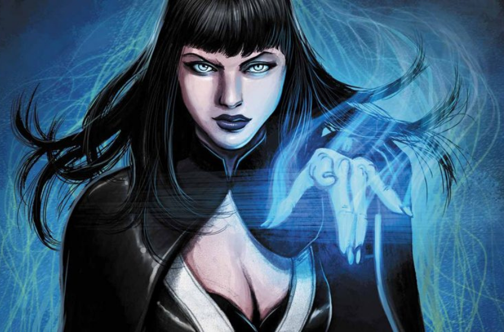 | Zatanna Zatara, tornar-se uma mágica de palco profissional quase parece uma escolha de carreira inquestionável. Inteligente, confiante, segura de si e capaz de manipular a própria realidade com suas vastas habilidades mágicas. Zatanna equilibra seu tempo como uma habilidosa ilusionista de palco com a luta contra as artes das trevas ao lado de alguns dos maiores super-heróis do mundo. |

| Herói | Imagem | Descrição |
| :-: | :-: | :-: |
| Blade |  | Blade, o Caçador de Vampiros é um anti-herói de histórias em quadrinhos da Marvel Comics. Foi criado pelo roteirista Marv Wolfman e pelo desenhista Gene Colan. Blade é conhecido como O Caçador de Vampiros, já que usa os seus dons anti-vampirícos para combate as criaturas sobrenaturais. Também foi adaptado por três vezes para o cinema. |
| Capitão América | 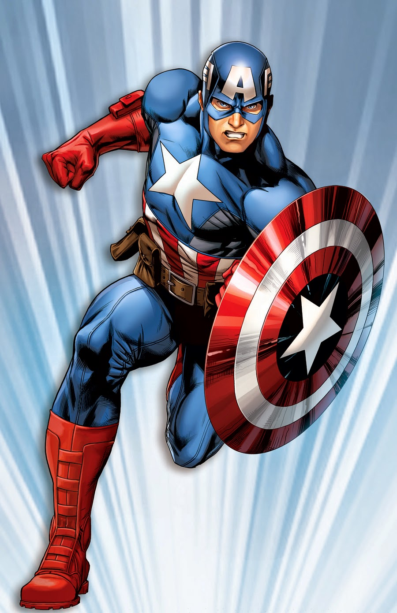 | Cpt. Steven "Steve" Rogers, o Primeiro Vingador, foi rejeitado pelo exército americano durante a Segunda Guerra Mundial devido a vários problemas de saúde. Ele se ofereceu como voluntário para o Projeto Renascimento, onde recebeu o Soro do Super Soldado desenvolvido pelo Dr. Abraham Erskine. O soro melhorou muito seu corpo frágil ao auge da fisicalidade humana. Ele foi descongelado na era moderna para continuar a batalha ao lado de seus novos aliados, os Vingadores. C.ap não é leal a nenhum político ou governo e, em vez disso, defende os "princípios atemporais de liberdade, igualdade e justiça do sonho americano" |
| Demolidor | 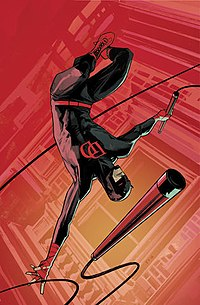 | O Demolidor (Matt Murdock) é um super-herói da Marvel Comics com sentidos aguçados e habilidades de luta excepcionais, graças a sua cegueira. Ele é um advogado brilhante e usa seus dons para proteger a cidade de Nova York contra o crime, enquanto luta contra seus próprios demônios pessoais. |
| Falcão | 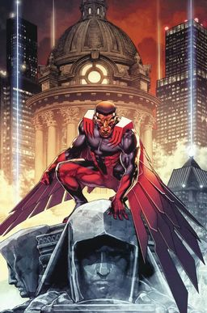 | Wilson recebe mais tarde a ajuda de Pantera Negra que cria asas mecânicas especiais que lhe permite voar. Falcão deixou de ser parceiro do Capitão América quando foi nomeado o líder dos super-agentes da S.H.I.E.L.D. |
| Gamora | 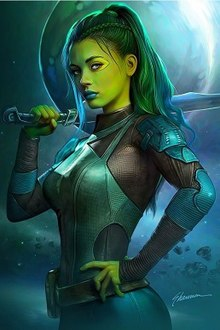 | Gamora é a última de sua espécie, a "Zen Whoberi". Thanos lhe mostrou um pouco de humanidade apenas durante sua infância, mas Gamora sempre foi muito leal ao homem que prometeu a ela a oportunidade de vingar a morte de sua família. Um tempo depois, Gamora foi aprisionada por Magus quando ele havia forjado sua morte e de vários outros Guardiões. Logo, ela foi resgatada e convidada por Star-Lord para integrar os Guardiões da Galáxia. Ela desempenhou um papel importante na batalha no "Cancerverse". |
| Gavião Arqueiro | 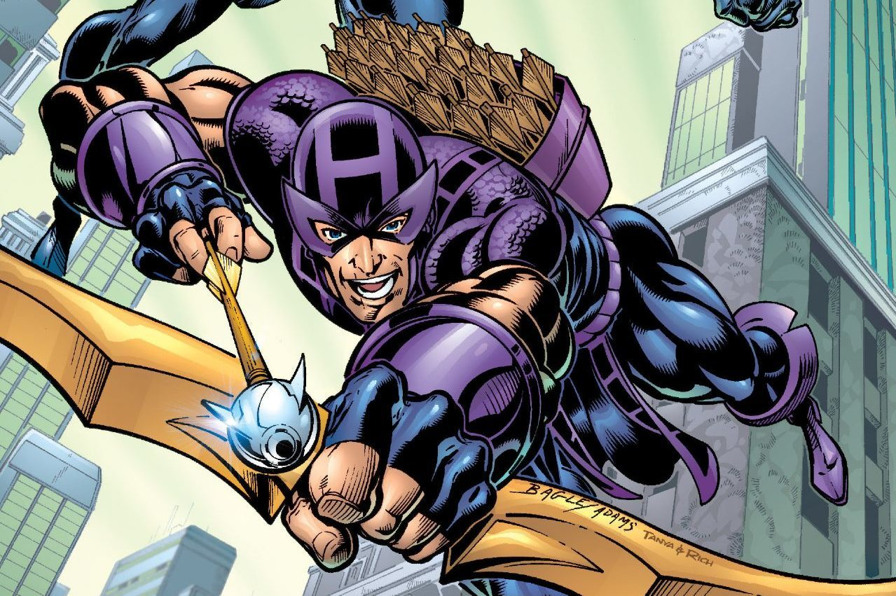 | Clinton "Clint" Barton também conhecido como Gavião Arqueiro é um atirador habilidoso americano, arqueiro, e ex-artista de circo e supervilão menor que se tornou membro dos Vingadores, "Os Heróis Mais Poderosos da Terra". Como membro dos Vingadores, ele sempre teve atrito com a equipe, mas sempre voltava para combater qualquer ameaça. Barton foi criado no circo, treinado por criminosos e cresceu de um jovem problemático para um dos maiores heróis da Terra. |
| Groot | 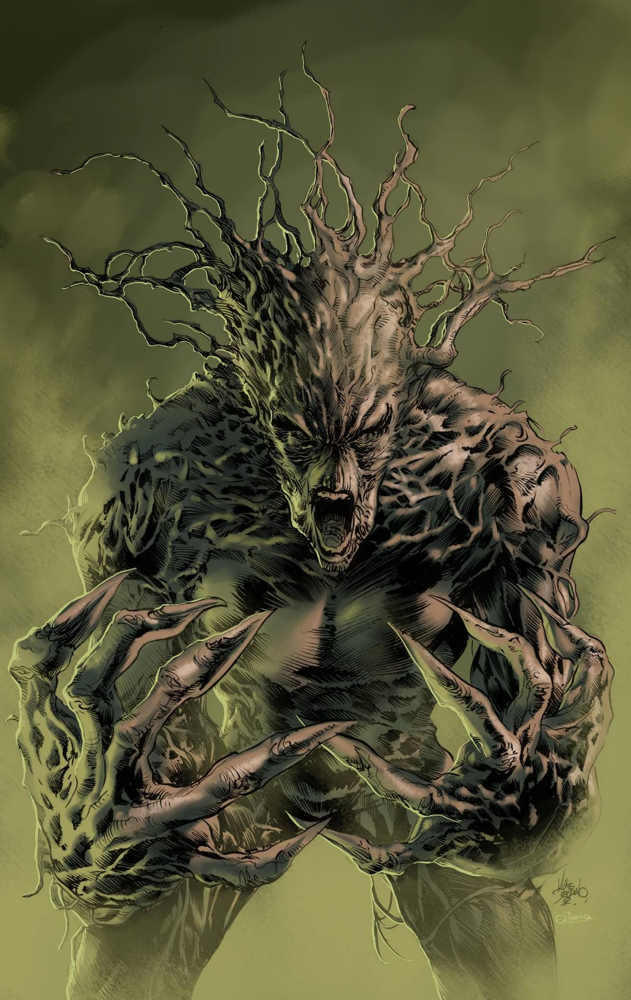 | Groot é uma árvore alienígena poderosa, ele possui várias habilidades físicas semelhantes a uma árvore normal e grande, e entre elas uma força maior que o normal, capaz de vencer lutando mão-a-mão e derrubar e quebrar qualquer objeto. Groot também pode se regenerar e reconstruir membros feridos. E além disso Groot também pode fazer crescer seus membros em formas de cipós e pode liberar esporos de luz. |
| Hércules | 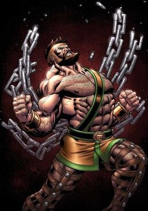 | Hércules era o filho de Zeus, rei dos deuses olímpicos, e Alcmena de Thebes em Greece antigo. Zeus seduziu Alcmena sob o disfarce de seu marido, Amphitryon que estava em guerra lutando contra os piratas de Taphos. Devido à sua linhagem olímpica, Hércules nasceu com o potencial de extraordinária força sobre-humana. |
| Homem de Ferro | 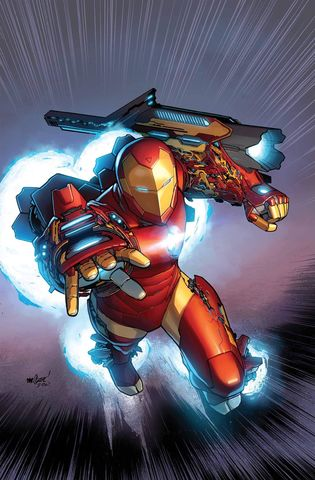 | Tony Stark, o Homem de Ferro, é um gênio inventor e super-herói da Marvel Comics que luta contra o crime com sua armadura de alta tecnologia. |
| Jean Grey | 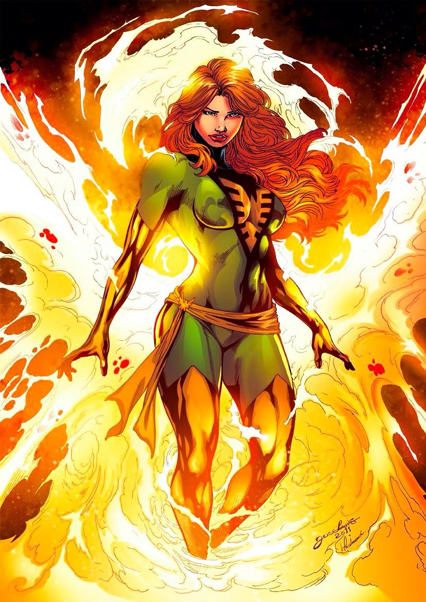 | Jean Gray é uma mutante com habilidades telepáticas e telecinéticas extremamente poderosas, capaz de mover objetos com a mente e ler mentes. Após ser exposta a radiação cósmica, Jean se torna a Fênix, uma entidade cósmica ainda mais poderosa. Sua história é marcada por conflitos internos entre seu lado humano e sua natureza mutante, além de lutas contra vilões e outras entidades cósmicas. Jean Gray foi interpretada por Famke Janssen na franquia cinematográfica dos X-Men. |
| Jéssica Jones | 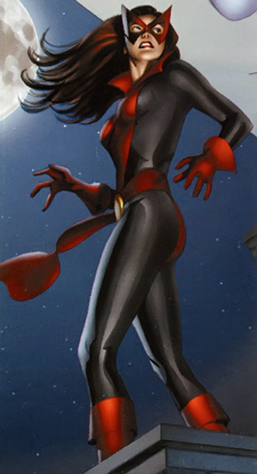 | Jessica Jones é uma personagem da Marvel Comics com habilidades sobre-humanas, incluindo super-força e vôo. Ela é uma investigadora particular talentosa e tem uma personalidade cínica e sarcástica. Jessica tem um passado traumático e uma família disfuncional, o que a leva a ter problemas de saúde mental. Ela tem laços com outros super-heróis, como Luke Cage e a Capitã Marvel, e muitas vezes usa suas habilidades para combater o crime em Nova York. |
| Justiceiro | 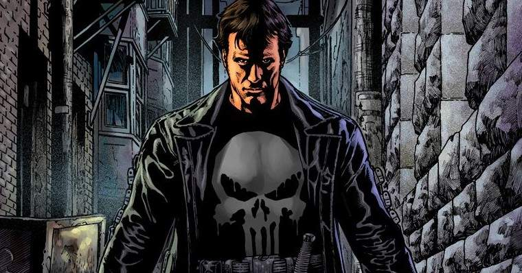 | Frank Castle e ele é um ex-fuzileiro naval que se tornou vigilante após sua família ser morta por criminosos. Ele é conhecido por usar táticas brutais e letais em sua luta contra o crime, muitas vezes entrando em conflito com outros heróis da Marvel. |
| Quasar | 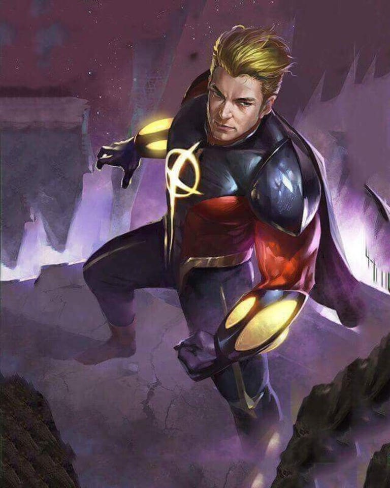 | Quasar é um super-herói cósmico que recebeu poderes de uma nave alienígena chamada de "Quantum Bands", que lhe conferem uma série de habilidades, incluindo voo, invulnerabilidade e manipulação de energia. Quasar já fez parte dos Vingadores e dos Defensores e é conhecido por suas aventuras no espaço. |
| Rocket Raccoon | 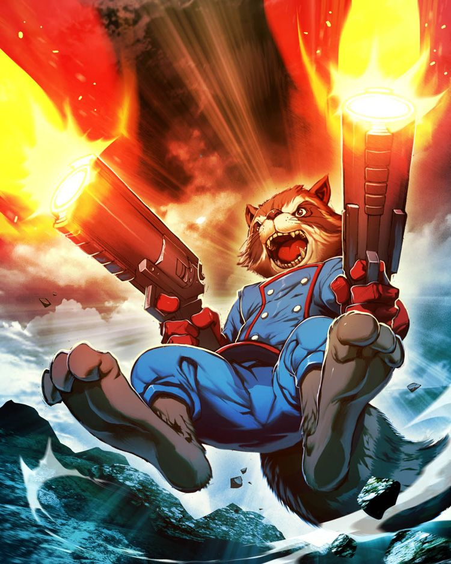 | Ele é um guaxinim antropomórfico geneticamente modificado, com habilidades como destreza em combate, habilidade com armas e estratégia. Rocket é um dos membros principais dos Guardiões da Galáxia, uma equipe de heróis espaciais da Marvel. Ele é conhecido por seu humor ácido e personalidade explosiva. |
| Tempestade | 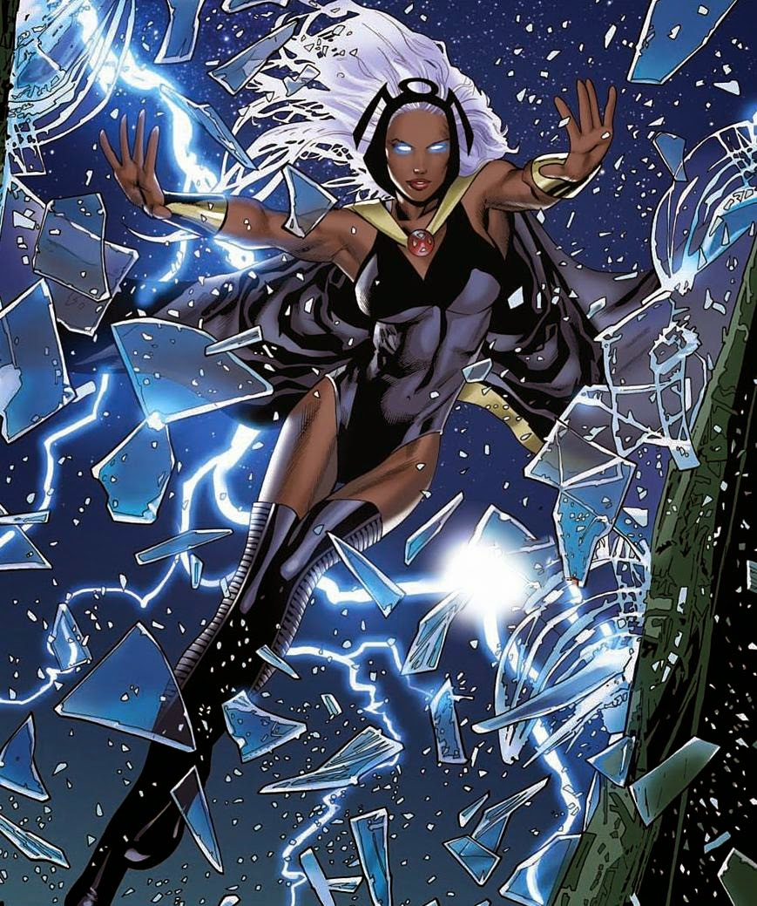 | Ororo Munroe é uma mutante com o poder de controlar o clima. Tempestade já fez parte dos X-Men, tendo sido líder da equipe em várias ocasiões, e também fez parte dos Vingadores. Ela é uma das personagens mais icônicas da Marvel e é conhecida por sua personalidade forte, determinação e habilidades incríveis.  |
| Thor | 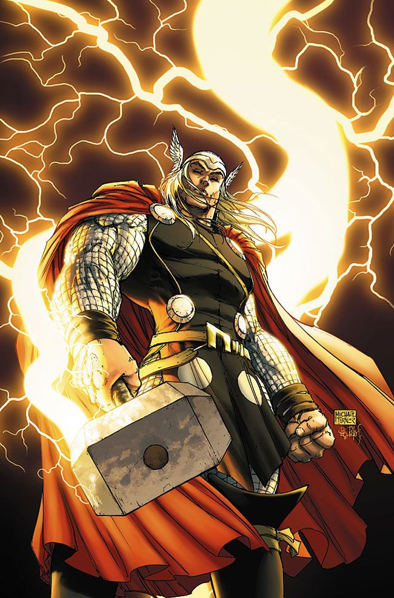 | Thor  é o Deus do Trovão e filho do poderoso Odin. Na versão da Marvel, Thor é um príncipe de Asgard, um reino dos deuses nórdicos, que é banido para a Terra por seu pai por causa de sua arrogância. |
| Vespa | 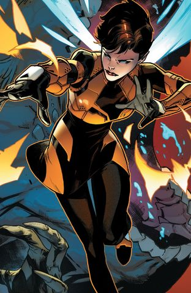 | Seu nome real é Janet van Dyne e ela é uma super-heroína que pode encolher de tamanho e voar, além de ter a habilidade de criar explosões de energia. A Vespa já fez parte dos Vingadores e também dos Defensores. Ela é conhecida por sua personalidade forte e por ter sido uma das primeiras heroínas da Marvel a ter sua própria série em quadrinhos. |
| Visão | 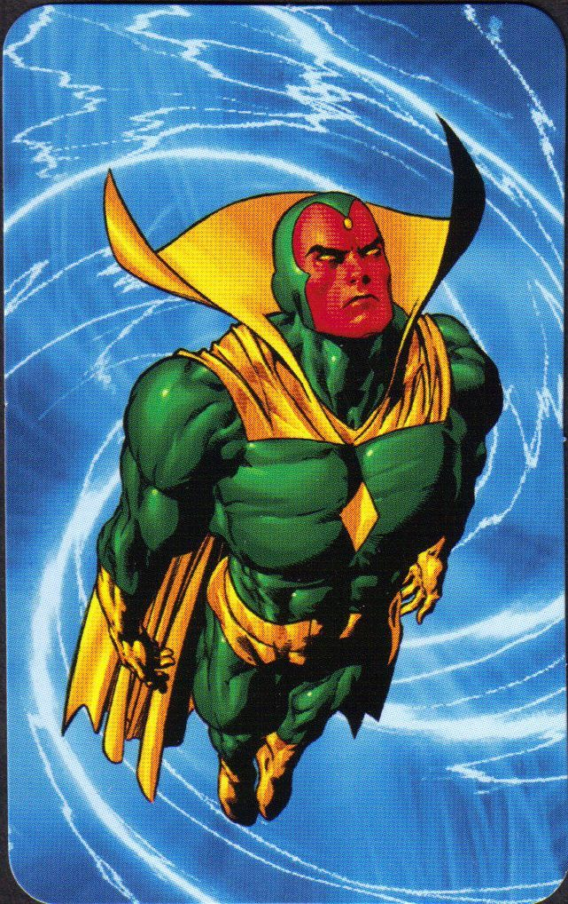 | Ele é um androide com inteligência artificial e uma série de habilidades, incluindo voo, força aprimorada, densidade variável e a capacidade de disparar raios de energia. Visão já fez parte dos Vingadores, tendo se tornado um dos membros mais importantes da equipe. Ele é conhecido por sua personalidade séria e lógica, além de ter tido um relacionamento amoroso com a Feiticeira Escarlate. |
| Viúva-Negra | 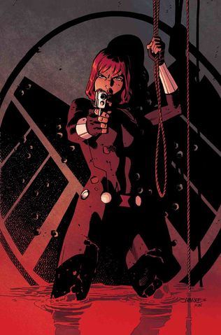| A Viúva Negra, alter-ego de Natasha Romanoff, nascida na União Soviética foi introduzida pela primeira vez como uma espiã russa, antagonista do super-herói Homem de Ferro. Mais tarde ela fugiu para os Estados Unidos, tornando-se uma agente da S.H.I.E.L.D. e membra da equipe de super-heróis Vingadores. |
| Wolverine | 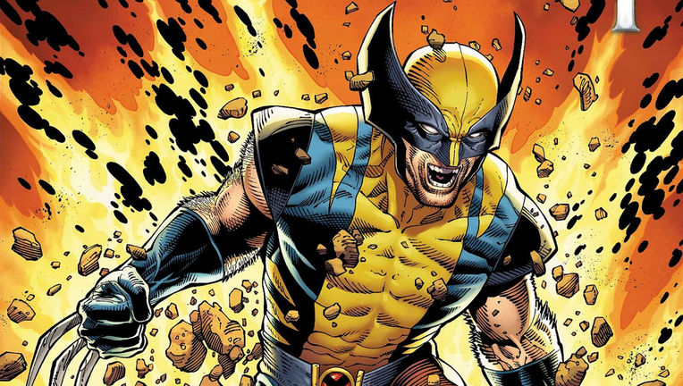 | Seu nome real é James "Logan" Howlett e ele é um mutante com habilidades regenerativas, sentidos aguçados e garras retráteis de adamantium. Wolverine já fez parte dos X-Men e dos Vingadores, além de ter tido várias séries em quadrinhos solo. Ele é conhecido por sua personalidade explosiva, instintiva e muitas vezes violenta, além de ter um passado misterioso e complexo |